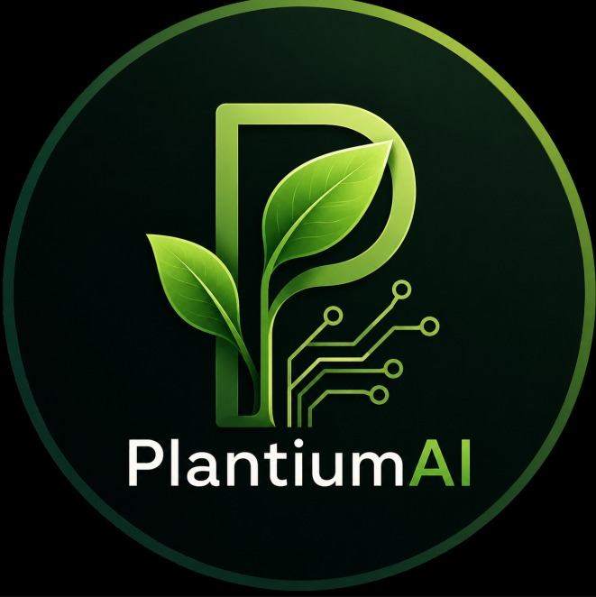

# PlantiumAI

<p align="center">
  
</p>

<p align="center">
  
  
  
  
  
  
</p>

Sistema inteligente de monitoramento para **micro estufas, plantações verticais e
containers**. Sensores IoT (ESP32) enviam leituras que são processadas e
visualizadas em tempo real — com alertas, decisão de irrigação e contexto de
clima. Hoje em duas frentes: uma **plataforma web multiusuário** (nuvem) e um
**app desktop** nativo para operação local com hardware.

---

## Estrutura do Projeto

```
PlantiumAI/
├── 📁 web/         # Plataforma web (Next.js + Auth.js + Drizzle/Neon) → Vercel
├── 📁 desktop/     # App desktop (Tauri 2 + React + TS, núcleo Rust)
├── 📁 firmware/    # Firmware ESP32 (NDJSON @ 115200 baud)
├── 📁 design/      # Design system e prompts de UI
├── 📁 HomePage/    # Landing institucional (referência de design)
└── 📁 documentos de referencia do projeto/   # Artigos, planilhas
```

> A base de conhecimento (decisões de arquitetura, regras portadas) vive no
> **Brain** — vault Obsidian compartilhado em repositório separado
> (`URSoftware/Brain`). Veja `CLAUDE.md`.

---

## Plataforma Web (`web/`)

Landing institucional → login → painel da empresa com sensores, locais
(estufa/vertical/container), tokens de firmware, usuários (empresa/cliente) e
dashboards por tipo de sensor. Clima via INMET/Google.

```bash
cd web
npm install
cp .env.example .env.local     # DATABASE_URL (Neon) + segredos
npm run db:push                # cria as tabelas no Neon
npm run dev                    # http://localhost:3000
```

**Deploy (Vercel + Neon):** passo-a-passo completo, com comandos SQL, em
**[web/DEPLOY.md](web/DEPLOY.md)**. Detalhes do app em [web/README.md](web/README.md).

---

## App Desktop (`desktop/`)

App nativo (Windows/Linux) que ingere os dados da ESP32 via serial.

```bash
cd desktop
npm install
npm run dev          # UI em modo demo (simulador, sem hardware)
npm run tauri dev    # app nativo (requer Rust: winget install Rustlang.Rustup)
npm run tauri build  # gera .msi/.exe ou AppImage/.deb
```

### ESP32

1. Grave `firmware/esp32_plantium/esp32_plantium.ino` (Arduino IDE/PlatformIO).
2. No app: aba **Dependências** → instale o driver do chip (CH340/CP210x).
3. Aba **Conexão** → selecione a porta → **Conectar ESP32**.

---

Projeto acadêmico e candidato ao Edital Desafio AgroStartup 2026.
